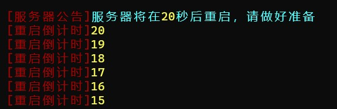

# PCC-Pration-Tools
一款简洁先进的服务器管理工具
# 一、我们能做什么
- 发布各种公告​
- 简单签到​
- 服务器投票​
- 服务器答题​
- ChatGPT聊天​
- 服务器关机倒计时​
# 二、插件指令
- /pcc：插件主指令
- /gonggao：发布公告
- /shout：喊话
- /stopp：倒计时关服
- /limbo：小黑屋
- /vote: 服务器投票
- /question: 发布问题
- /answer: 回答问题
- /chat：ChatGPT聊天
- /signin：签到
- /signin_week：领取连续签到奖励
# 三、权限节点
- pcc.command.gonggao：发布公告
- pcc.command.shout：管理员喊话
- pcc.command.stop：关闭服务器
- pcc.command.config：使用指令更改配置等
- pcc.command.limbo：小黑屋
- pcc.command.limbo.cnacel：取消小黑屋
- pcc.command.chat：ChatGPT问答权限
- pcc.signin：签到权限
- pcc.signin_week：领取连续签到奖励权限
 # 四、效果预览
- /chat：ChatGPT聊天​\

- 定时/进服公告​\

- /gonggao：发布公告​\

- 问答​\

- /shout：喊话​\

- /signin：签到​\

- /stopp：倒计时关服​\

- 投票系统：待补充
# 五、插件配置
插件基本功能配置请看**配置文件**内，**注释**已经足够详细了，如还有疑问可在**discussions**中提出，如有**bug或建议**请在**issues**中反馈
## 如果是关于ChatGPT的配置，点击下面链接
[配置关于ChatGPT功能](https://github.com/73410/PCC-Pration-Tools-GPT-Sever)
# 六、友情链接
[minebbs上的发布](https://www.minebbs.com/resources/pration-tools.8036/)
# 七、主要功能模块与类说明
- 插件主类：`Pcc_limbo_system`，负责插件的初始化、指令注册、配置加载等。
- 指令实现类：如 `main`（主指令）、`gong_gao`（公告）、`shout`（喊话）、`stop`（倒计时关服）、`limbo`（小黑屋）、`vote`（投票）、`question`/`answer`（答题）、`ChatCommandExecutor`（ChatGPT 聊天）、`sign_in`/`sign_in_week`（签到）。
- 任务与事件监听：如 `join`（进服公告）、`timer`（定时公告）等。

# 八、详细指令与用法示例
下面列出常用指令及其用法，`[]` 为可选参数：
- `/chat <内容> [模型]`：与 ChatGPT 聊天，模型可选 `gpt-4o`/`gpt-4o-mini`，使用 `/chat clear` 可清除会话。例如：`/chat 你好 gpt-4o`。
- `/gonggao <内容>`：向全服发布公告。如：`/gonggao 服务器即将维护`。
- `/shout <颜色> <内容>`：带颜色的喊话，颜色可选 `yellow/green/blue/red/white/aqua`，示例：`/shout red 今天活动开始！`。
- `/stopp`：根据配置文件中的时间开始倒计时关服，常用于重启服务器。
- `/limbo <玩家> <1|2|cancel>`：将玩家关进或放出小黑屋，其中 `1`、`2` 代表不同房间，`cancel` 为解除。
- `/vote <on|off|reset|result|pull>`：开启或关闭投票，重置数据、查看结果或向玩家推送投票。例如：`/pcc vote pull` 发布投票选项。
- `/question` 与 `/answer <选项>`：发布答题并作答，题目及奖励在 `question.yml` 中配置。
- `/signin`、`/signin_week`：每日签到与连续七天签到奖励，满足条件后使用 `/signin_week` 领取。

# 九、配置文件说明
- `config.yml`：插件主配置，包含公告、投票、签到等功能的开关与参数。
- 其他 yml 文件：如 `question.yml`（题库）、`sign.yml`（签到数据）、`vote_result.yml`（投票结果）等。

# 十、依赖与兼容性
- 依赖 Bukkit/Spigot/Paper 服务器。
- 需 Java 21 环境。
- ChatGPT 聊天功能需额外后端服务支持（详见上文链接）。

# 十一、贡献与反馈
- 欢迎通过 issues/discussions 反馈问题与建议。
